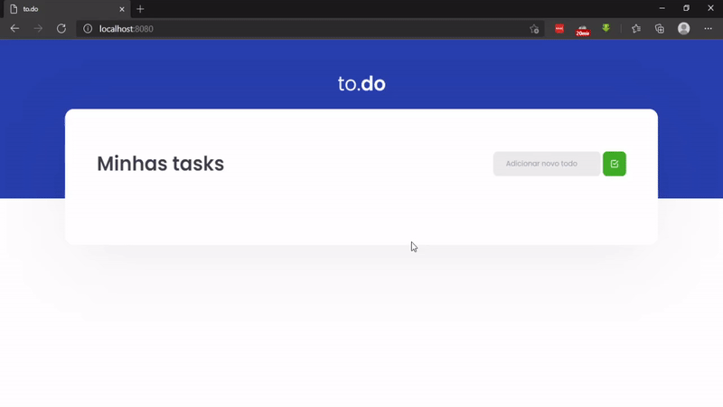

<h1 align="center">
  
</h1>
</p>

## Table of Contents
* [Introduction](#introduction)
* [Tecnologies](#tecnologies)
* [Features](#features)
* [How To Use](#how-to-use)


## Introduction

Keep track of your activities with to.do

## Tecnologies

* React
* Sass

## Features

A few of the things you can do with to.do:

* Add to-do
* Complete to-do
* Remove to-do

<p align="center">
  
</p>

## How To Use

To clone and run this application, you'll need Git and Node.js (which comes with npm) installed on your computer. From your command line:
```bash
# Clone this repository
$ git clone https://github.com/ardotheedu/to.do-ignite

# Go into the repository
$ cd to.do-ignite

# Install dependencies
$ yarn

# Run the app
$ yarn dev
```
Open [http://localhost:8080](http://localhost:8080) with your browser to see the result.


